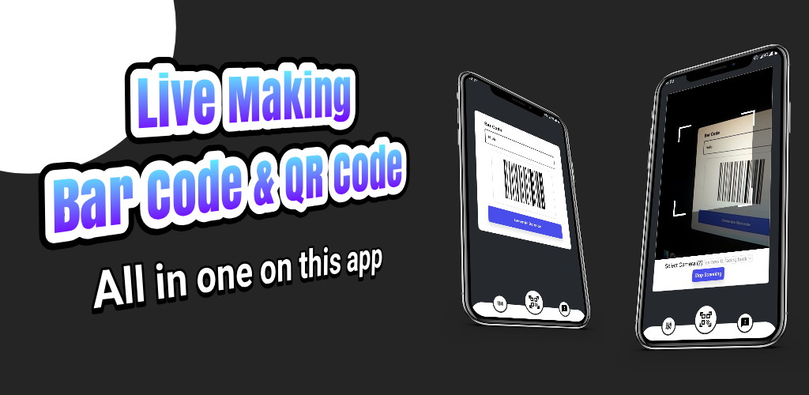
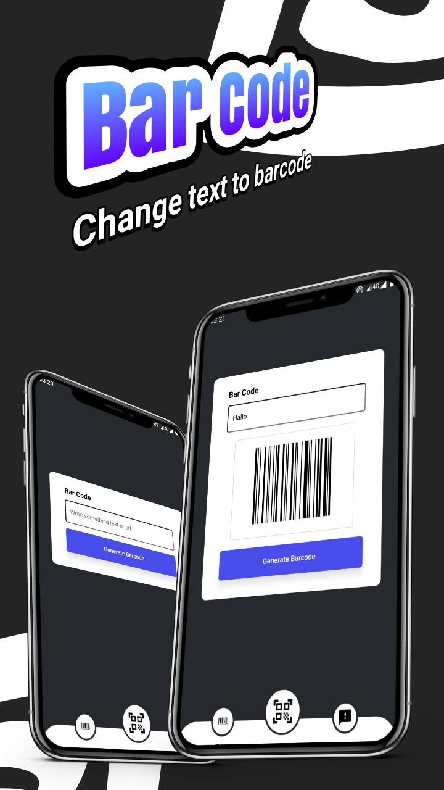
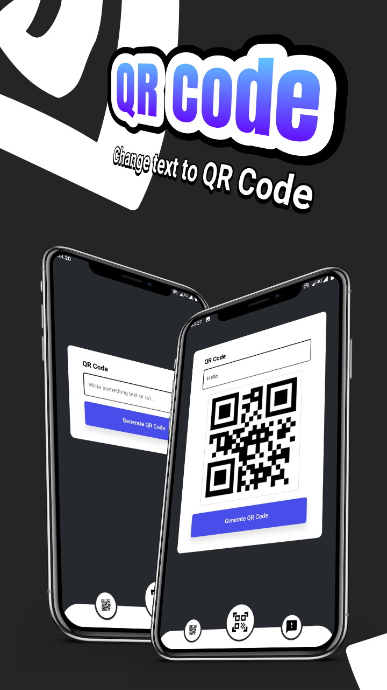

# Live Making Barcode (LMB)
Make your day easier by generating live barcodes also with the scan camera. Only in the Live Making Barcode (LMB) application, you will get access to this feature for free without a monthly subscription.

# Build Apps (Android OS)
1. > Min SDK 19
2. > Full webview API
3. > Minimalist UI/UX
4. > Access to permission

# Screenshot
[](https://cusmedroid.github.io/livemakingbarcode)

[](https://cusmedroid.github.io/livemakingbarcode)  [](https://cusmedroid.github.io/livemakingbarcode)  [](https://cusmedroid.github.io/livemakingbarcode)

# Guide App
``` txt
 1. Enter your text or url on input
 2. Click generate QR or Bar Code
 3. Click icon on the navigation on the bottom left to select barcode or qr code
 4. Click icon on the navigation on the center to scanner
 5. Click icon on the navigation on the bottom right to feedback
```

I developed it so that users can directly enter text to generate barcode [LMB](https://cusmedroid.github.io/livemakingbarcode/barcode.html) or qrcode [LMB](https://cusmedroid.github.io/livemakingbarcode/qrcode.html).

# Scanner
You can scan the barcode or QR Code [here](https://cusmedroid.github.io/livemakingbarcode/scanner.html).

# Embed
Easy to embed this for your website.

Bar Code :
``` html
<iframe src="https://cusmedroid.github.io/livemakingbarcode/barcode.html"></iframe>
```

QR Code :
``` html
<iframe src="https://cusmedroid.github.io/livemakingbarcode/qrcode.html"></iframe>
```

Scanner :
``` html
<iframe src="https://cusmedroid.github.io/livemakingbarcode/scanner.html"></iframe>
```

Style :
``` css
iframe {
  width: 100%;
  height: 100%;
  border: 0;
  overflow: auto;
}
```

All in one on app Live Making Barcode (LMB)
